**视听语言**  
**小孔成像****镜头结构**  

**一、镜头概念**  
**原理：镜头是聚光成影的工具**  
**1.焦距****焦距决定着影像的大小**  
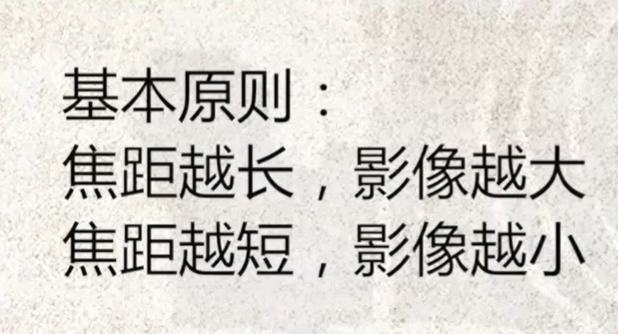  
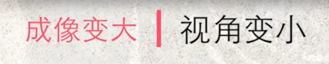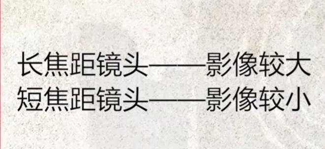  
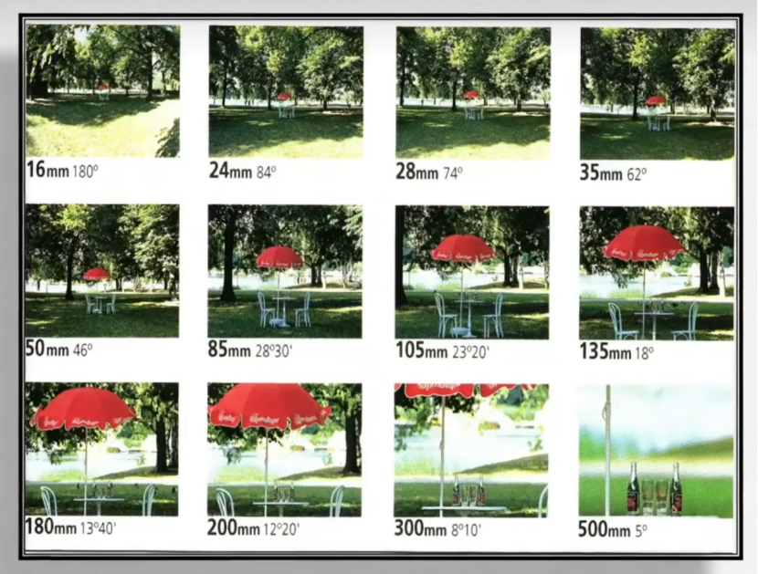  

**2.广角和望远镜头**  
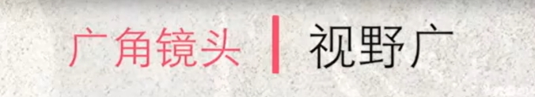  
**广角镜头：看的范围大，物体小**  
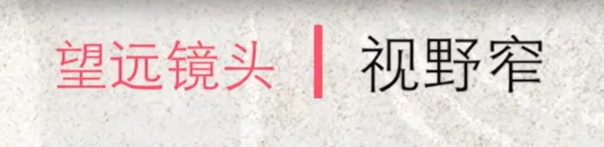  
**望远镜头：将远处视角放大**  
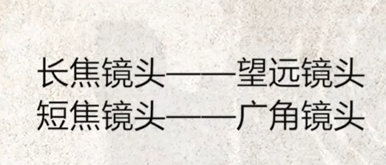  
**3.镜头标准长度的衡量**  
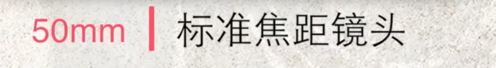  
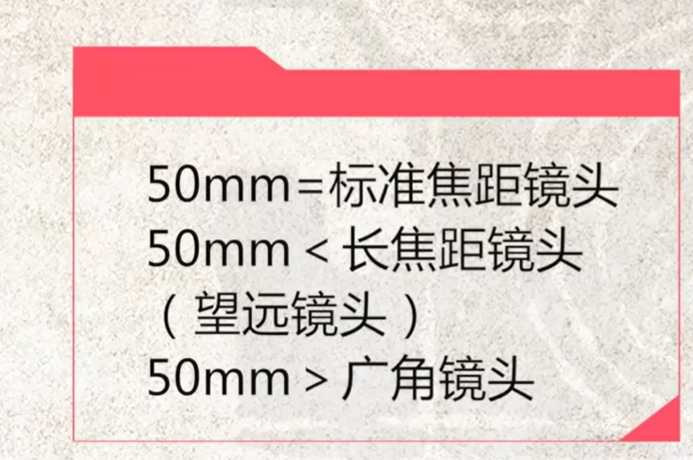  
**2、景深****概念：主体以外是模糊的

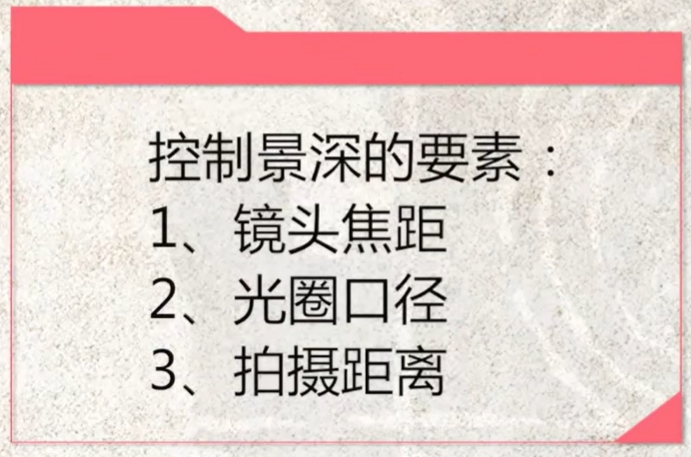  
**3、曝光1.密度适中密度高指的是黑点多，密度小就是比较亮2.有明暗层次3.亮部暗部都要有细节4、曝光的要素5、侧面和侧逆光**

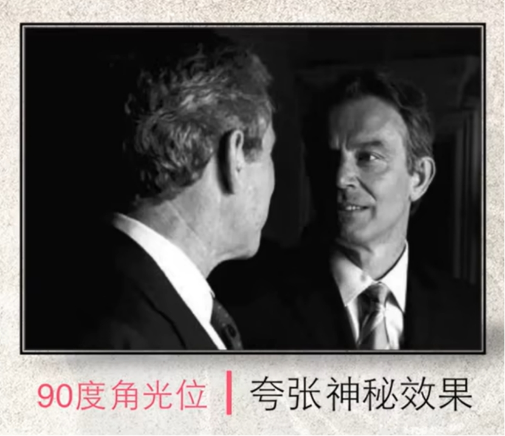  
**6、逆光（剪影）/轮廓光**

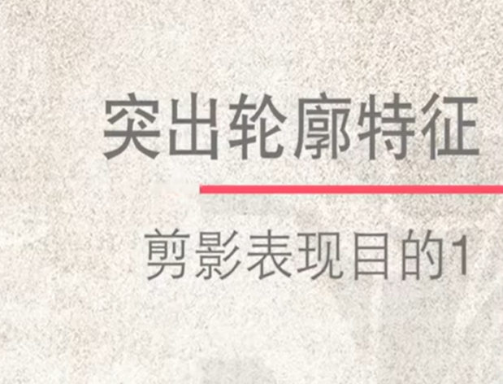  