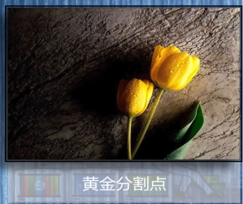
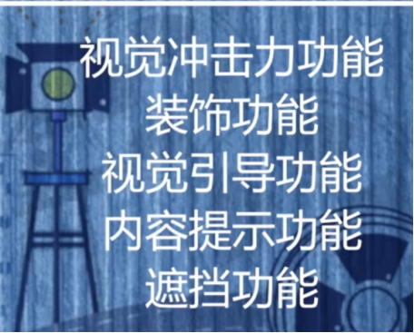

  
**居中偏右****的位置为****黄金分割点****明暗法：主体在明亮处，辅助在暗处****虚实法：主体清晰，辅助虚化****突出主体：明暗、虚实、色彩反差 、线条反差****2、陪体****3、前景**

**4、色调**·  **冷色调**：如蓝色、绿色、紫色等，通常用于表现忧郁、冷静、孤独、神秘或压抑的氛围。冷色调往往让人感受到距离感和严峻感，如犯罪片、科幻片中常见。

·   **暖色调**：如红色、橙色、黄色等，通常传递出温暖、舒适、激情或温情的氛围。常见于爱情片、家庭剧或者表现阳光、温暖的场景。

·   **黑白色调**：主要通过对比和明暗关系营造强烈的视觉冲击感，常常用于复古、艺术电影或者历史题材作品中，表现简洁、经典、戏剧性或纪实风格。

·  **高对比度色调**：高对比度常用来突出人物、物体或情节，增强戏剧冲突感。这种风格往往给人一种视觉上的冲击力，特别适用于悬疑、惊悚、动作片等类型。

·  **柔和色调**：通过柔和的光线和色彩，使画面看起来更加温和、自然、梦幻。常见于浪漫、幻想、疗愈类题材的影视作品。

·  **复古/怀旧色调**：模仿老电影的色彩风格（例如棕色、褐色、黄色等），带有时光流逝的感觉，往往用在怀旧、历史、复古类的作品中。

·  **冷暖对比色调**：通过冷暖色的对比来增强画面的视觉冲击感或强调剧情中的对立。常见于英雄电影或复杂情节的作品中  

**5、线条****画面中的曲线条****
